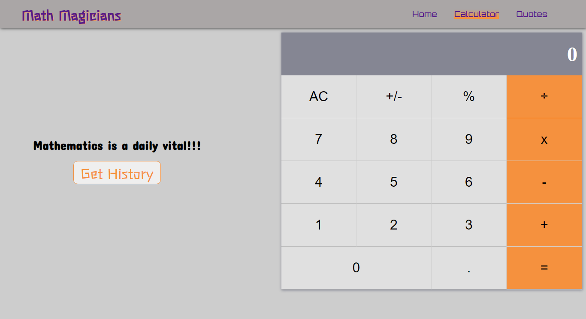

# Math Magicians Calculator

A browser calculator built for the Math Magicians company.

## Application Screenshot

## Content

<a text-align="center" href="#about">Background</a>&nbsp;&nbsp;&nbsp;|&nbsp;&nbsp;&nbsp;
<a href="#ins">Installations</a>&nbsp;&nbsp;&nbsp;|&nbsp;&nbsp;&nbsp;
<a href="#usage">Usage</a>&nbsp;&nbsp;&nbsp;|&nbsp;&nbsp;&nbsp;
<a href="#app">App</a>&nbsp;&nbsp;&nbsp;|&nbsp;&nbsp;&nbsp;
<a href="#with">Building</a>&nbsp;&nbsp;&nbsp;|&nbsp;&nbsp;&nbsp;
<a href="#tests">Testing</a>&nbsp;&nbsp;&nbsp;|&nbsp;&nbsp;&nbsp;
<a href="#author">Author</a>

## Background 

This project was a task by [Microverse Inc.](https://www.microverse.org/) to build a browser calculator for the Math Magicians fictitious company. The milestones listed below constituted the project development in order of execution:
1. Project setup - This involved using `create-react-app` to initialize the application and setting up the necessary dependencies.
2. Build the calculator user interface - This involved implementing the project React components.
3. User interface update - This is when the User Interface was modified with CSS style rules and flexbox rules.
4. Calculator functionality - Javascript functions were implemented to manage the calculator arithmetic logic.
5. Harmonize the calculator logic and the calculator components - The calculator functionality was implemented by using event listeners to make the calculator components respond to the calculator logic.

## Live Calculator Demo

The built app is hosted on Heroku  

### You may see the demo version [here](https://peaceful-lake-84379.herokuapp.com/)

## 🔧 Building

The tools used to build the calculator are listed below:

- Javascript(ES6).
- React
- prop-types node module
- big.js node module
- eslint
- stylelint

## Usage 

To use the code in this repository, follow the steps in this section:

### 🔨 Prerequisites

You should have the following packages installed on your computer inorder to run the code contained herein.

- Node JS
- npm and npx

### 🔨 Setup

First get a copy of the project on your computer:

- Clone or download the repository to a local directory on your computer by following the Github instructions at [Github clone/download repository](https://docs.github.com/en/enterprise/2.13/user/articles/cloning-a-repository).

### 🛠 Installing 

Once you have a local copy of the entire project on your computer, then:

- If you don't meet the above prerequisites, visit [node download and installations docs](https://docs.npmjs.com/downloading-and-installing-node-js-and-npm) to install node js and npm.
- Run `npm install` to install the project dependencies in the package.json file.

### Testing 

Jest <b>will be   used to test the code contained herein.
To run the tests written in this project, then:

- Type/copy `npm run test` into the terminal and strike `Enter`.

### App 

With the installations above complete, you are set to locally use the code. Follow these simple steps:

- Change directory into the directory where you cloned the repository.
- Open the project directory in your editor of choice. For example running `code .` will open the project in VSCode.
- Run `npm start` to start webpack-dev-server.
- If everything worked well, the browser should automatically render the calculator on `http://localhost:3000/`.

## ✒️ Author 

👤 **Mworekwa Ezekiel**

- Github: [@vanheaven-ui](https://github.com/vanheaven-ui)
- Twitter: [@MworekwaE](https://twitter.com/MworekwaE)
- Linkedin: [@linkedin](https://www.linkedin.com/in/vanheaven/)
- Email: [ezekiel](mailto:vanheaven6@gmail.com)

## 🤝 Contributing

Contributions, issues and feature requests are welcome!

- To create an issue, visit the [issues page](https://github.com/vanheaven-ui/React-calc/issues) and create a new issue.
- To contribute to the code base, follow the steps below:
  1. Fork this repository to your remote respository by clicking the Fork button in this repository.
  2. Clone this repository to a directory on your computer by following Github guidelines.
  3. Change directory into the directory where you cloned this repository to.
  4. Open the directory using your favorite editor.
  5. Create a feature branch off the develop branch.
  6. Make and commit the nuanced code.
  7. Open a pull request describing the improvements made
     And your reward awaits in heaven.

## 👍 Show your support

Give a ⭐️ if you like this project!

## :clap: Acknowledgements

- [Microverse Community](https://www.microverse.org/)  
- [React Official Documentation](https://reactjs.org/)
